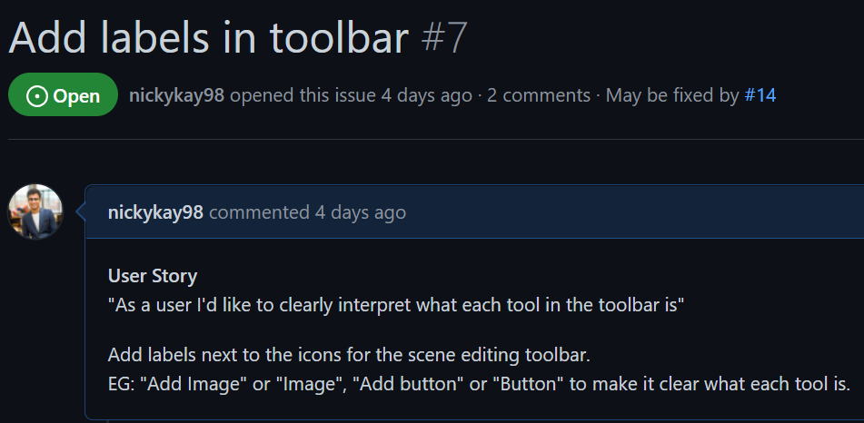
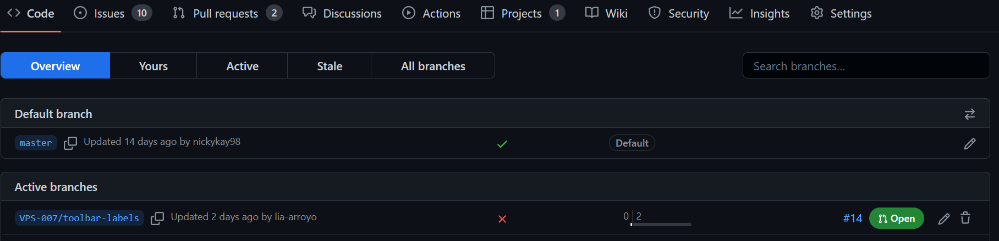
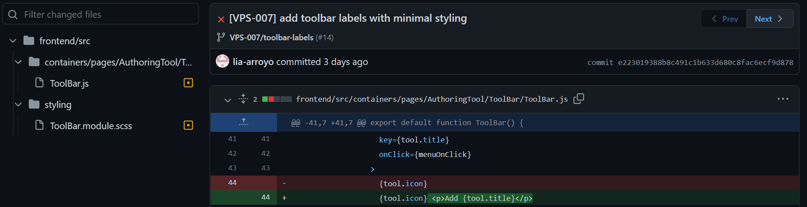

# VPS

This project aims to provide Medical and Health Science students at the University of Auckland with a tool that supports interactive and immersive education through virtual patient scenarios.

This project was associated with The University of Auckland SOFTENG 761 but since 2022, is being developed by WDCC project teams. The repo located here for this project is a bare clone of [the original repo](https://github.com/Collabs-uni/virtual-patient-system) and has been created using [these instructions](https://docs.github.com/en/repositories/creating-and-managing-repositories/duplicating-a-repository#mirroring-a-repository=) to preserve past contributors and commits. 

Changes in this repo are not synced with the original repo (and are not required to be synced since the original repo is not worked on anymore) but if needed, it can be done by setting up a remote push location using the instructions above.

# Live deployments

DEV: https://vps-dev.wdcc.co.nz/

<!-- prettier-ignore -->
| CI                  | Status   |
| ------------------- | -------- |
| ESLint              | [](https://github.com/SoftEng761-2021/project-project-team-1/actions/workflows/eslint.yml) |
| Prettier            | [](https://github.com/SoftEng761-2021/project-project-team-1/actions/workflows/prettier.yml) |
| Tests               |  [](https://github.com/SoftEng761-2021/project-project-team-1/actions/workflows/unit_tests.yml) |
| Contributors        | [](#contributors-) |

# Setup and Run

1. Download and use the following versions to make this repository work:
    - node v14.17.\* - node 1.16+ does not work due to dependency issues
    - yarn 1.22.\*
    - NPM 6.14.\*
2. Download the repo onto your machine
3. Set up your .env files 
    1. Create 2 copies of https://github.com/UoaWDCC/VPS/blob/master/backend/.env.example and place them at the same level as the .env.example file in __frontend/__ and __backend/__
    2. Rename them to __.env__ (make sure they are named exactly that and not .env.txt and that they aren't TXT files)
    3. Get the values for each key in the .env files using the links provided in them + any login details provided by the PM/APM
    4. In the frontend .env file, add `REACT_APP_SERVER_URL = "http://localhost:[BACKEND_PORT_NUMBER]/"` and replace `[BACKEND_PORT_NUMBER]` with the value of `PORT` in the backend .env file e.g. 5001
4. To continue setting up the app, follow Method 1 below (if that doesn't work, try Method 2)

⚠️ DO NOT share the .env file with anyone or upload it to GitHub or anywhere else - the file basically gives access to our databases which contain all the website assets and user information (including yours)

## Method 1

- Run `yarn install` in the root directory
- Run `yarn run init` in the root directory (installs dependencies for `frontend` and `backend` directories)
- Run `yarn run dev` in the root directory to start both `frontend` and `backend` environments to run the app

## Method 2

- Open two terminals
- Change directory by running `cd frontend` and `cd backend` in each terminal
- Run `yarn install` in each terminal
- Run `yarn start` in each terminal to run the app

# Test and CI/CD

1. Open terminal and `cd frontend` or `cd backend` depending on which folder you are testing
2. Run `yarn run test` to run unit tests;
3. Run `yarn run lint` to lint; Run `yarn run lint:fix` to fix linting;
4. Run `yarn run prettier` to test for prettier; Run `yarn run prettify` to fix prettier issues;

To update the Jest snapshots (e.g. when updating the UI) and pass all the frontend tests:
1. In VPS/frontend, run `yarn run test` to run unit tests;
2. Press `a` to run all tests - some may fail and if they do, press `w` to show more then `u` to update failing snapshots - all tests should pass now
3. Press `w` then `q` to exit
4. Commit the updated snapshots before opening a PR

More information on Jest snapshot testing: https://jestjs.io/docs/snapshot-testing

# Git conventions

## Branches

Create a branch for your issue and name the branch __VPS-{ISSUE NUMBER}/{ISSUE NAME}__ (if the issue name is long, a shorter version if also fine)
  - e.g. the issue below has the name __Add labels in toolbar__ but a branch named __VPS-007/toolbar-label__

  

## Commit messages

For each commit you make, follow this convention: __[VPS-{ISSUE NUMBER}] Your commit message__
  - e.g. __[VPS-007] add toolbar labels with minimal styling__
  


## Pull requests

Once you've made all your commits, open a PR with the name __VPS-{ISSUE NUMBER}/{ISSUE NAME}__ and fill in the details (the PR template can be found [here]( https://github.com/UoaWDCC/VPS/blob/master/.github/pull_request_template.md))
  - e.g. __VPS-007/Add labels in toolbar__
  

# File Structure

```.
├── frontend/
│ └── src
│ └── package.json
├── backend/
│ └── src
│ └── package.json
├── wiki/
│ ├── react-movable.md
│ └── ...
├── README.md
├── package.json
└── ...
```

# Contributors ✨

Thanks goes to these wonderful people ([emoji key](https://allcontributors.org/docs/en/emoji-key)):

<!-- ALL-CONTRIBUTORS-LIST:START - Do not remove or modify this section -->
<!-- prettier-ignore-start -->
<!-- markdownlint-disable -->
<table>
  <tr>
    <td align="center"><a href="https://github.com/lucas2005gao"><br /><sub><b>Lucas Gao</b></sub></a><br /><a href="https://github.com/lucas2005gao/REACT Template/commits?author=lucas2005gao" title="Code">💻</a></td>
    <td align="center"><a href="https://github.com/flexzy"><br /><sub><b>Felix Yang</b></sub></a><br /><a href="https://github.com/lucas2005gao/REACT Template/commits?author=flexzy" title="Code">💻</a></td>
    <td align="center"><a href="https://github.com/David-Xia0"><br /><sub><b>David Xiao</b></sub></a><br /><a href="https://github.com/lucas2005gao/REACT Template/commits?author=David-Xia0" title="Code">💻</a></td>
    <td align="center"><a href="https://github.com/zyan225"><br /><sub><b>zyan225</b></sub></a><br /><a href="https://github.com/lucas2005gao/REACT Template/commits?author=zyan225" title="Code">💻</a></td>
    <td align="center"><a href="https://github.com/dongmeilim"><br /><sub><b>Dong Mei Lim</b></sub></a><br /><a href="https://github.com/lucas2005gao/REACT Template/commits?author=dongmeilim" title="Code">💻</a></td>
    <td align="center"><a href="https://github.com/annithinggoes"><br /><sub><b>annithinggoes</b></sub></a><br /><a href="https://github.com/lucas2005gao/REACT Template/commits?author=annithinggoes" title="Code">💻</a></td>
    <td align="center"><a href="https://github.com/afei088"><br /><sub><b>Andrew Fei</b></sub></a><br /><a href="https://github.com/lucas2005gao/REACT Template/commits?author=afei088" title="Code">💻</a></td>
  </tr>
  <tr>
    <td align="center"><a href="https://github.com/NatalyMartini"><br /><sub><b>NatalyMartini</b></sub></a><br /><a href="#business-NatalyMartini" title="Business development">💼</a> <a href="#content-NatalyMartini" title="Content">🖋</a></td>
  </tr>
</table>

<!-- markdownlint-restore -->
<!-- prettier-ignore-end -->

<!-- ALL-CONTRIBUTORS-LIST:END -->

This project follows the [all-contributors](https://github.com/all-contributors/all-contributors) specification. Contributions of any kind welcome!
