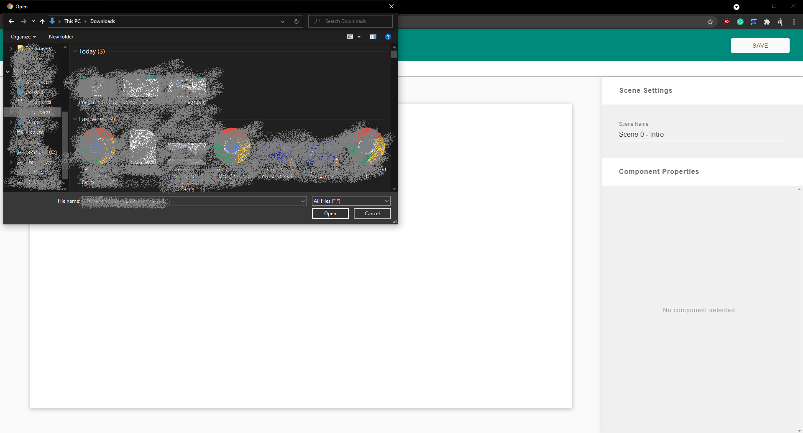

# User Manual

## Login

On entering the default website url, users will be prompted to login using a google account.

 

## Scenario Dashboard Page

Upon successfully logging in, Users will be greeted by their Scenario Dashboard Page. This page contains all scenarios created by the logged in user.

(1) This button allows the user to create new scenario and will redirect them to the Scene Dashboard Page.

(2) This area contains all scenarios created by the user. Clicking on a scenario card will select the scenario.

(3) Clicking on the scenario name allows the user to edit and change the name of their scenario. The name change is automatically saved when the text is unfocused.

(4) This button allows the user to play the currently selected scenario. Clicking will redirect them to the Play Scenario Page.

(5) This button allows the user to edit their selected scenario and will redirect them to the Scene Dashboard Page.

(6) This button deletes the selected scenario.

(7) This button logs the user out and they are redirected to the login screen.

 

## Scene Dashboard Page

The page contains all the scenes created within a scenario.

(1) This button takes the user back to the Scenario Dashboard Page.

(2) This dashed card allows the user to create new scenes. Clicking the card will take the user to the Authoring Tool page.

(3) This area contains all scenes within this scenario. Clicking on a scene card will select the scene.

(4) Clicking on the scene name allows the user to edit and change the name of the scene. The name change is automatically saved when the text is unfocused.

(5) This button deletes the selected scene.

(6) This button allows the user to edit a selected scene and redirects them to the Authoring Tool Page.

(7) This button allows the user to duplicate a selected scene with all its components and their properties.

(8) This button allows the user to play the current scenario. Clicking will redirect them to the Play Scenario Page.

(9) This button allows the user to share the current scenario. Clicking will present a share modal.

 

### Share Modal

 

## Authoring Tool Page

This page is used for editing the components within a scenario.

(1) This button takes the user back to the Scene Dashboard Page.

(2) This is the tool bar and contains all components that can be added to the canvas.

(3) This button is for adding images components.

(4) This button is for adding text components.

(5) This button is for adding button components.

(6) This button is for adding audio components.

(7) This is the canvas and represents the scene and all its components. Users can select any component on the canvas simply by clicking on it. For example, the start button.

(8) This button saves the users changes in the scene. All changes on this scene will not persist unless this button is pressed.

(9) The name of the scene can be changed here.

(10) This sections shows all of the properties assocaited with the selected component.

 

Leaving the page without saving will prompt the user to save their changes or discard them.

 

### Image component

Clicking on the image icon tool bar presents two options.

(1) The first option presents the image Modal where a user can select an image from an existing image bank of medical images.

(2) The second option presents a file explorer, where users can upload their own images to the canvas.

#### Image Modal

#### Image File Explorer

### Text Component
This component is used to display text on the canvas.

(1) The specific text to be displayed can be entered here.

(2) The font size can be adjusted.

(3) The text Alignment can be adjusted.

(4) The color can be adjusted.

(5) The border and background can be toggled on and off.

 

### Button Component
This component is used to transition to different scenes.

(1) The text on the button can be edited.

(2) The style of the button can be changed.

(3) The color of the button can be changed.

(4) The scene to transition to can be selected and changed.

 

### Audio Component
This component is used to play sound on a scenes. Once the scene loads the audio component will start playing.

(1) This button can be used to test the audio being played.

(2) This toggle can be used to loop the audio once playing.

## Resizing and Dragging Components
All components can be dragged and resized. Clicking on an component will select that component. Selected components are outlined with a resizable box. Dragging on dots of the resizeable box will resize the component according to your new cursor position. Dragging the component will cause the component to change positions acccording to your new cursor position. 

## Deleting Components
Selected components can be deleted by pressing the "backspace" or "delete" key.

